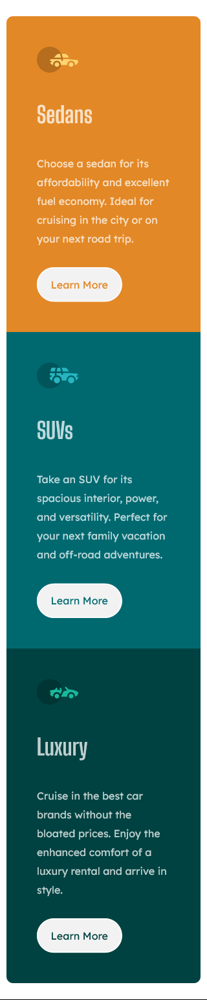
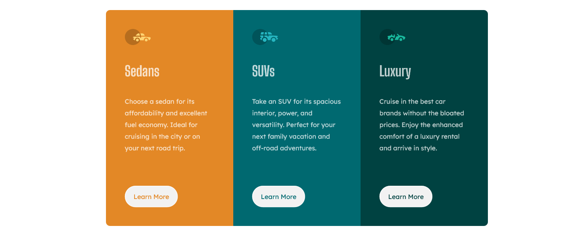

# frontendMentorC02_3Column
This design from frontend mentor (https://www.frontendmentor.io/challenges/3column-preview-card-component-pH92eAR2-) with three column design. Implement using Mobile first approach

# Frontend Mentor - 3-column preview card component solution

This is a solution to the [3-column preview card component challenge on Frontend Mentor](https://www.frontendmentor.io/challenges/3column-preview-card-component-pH92eAR2-). Frontend Mentor challenges help you improve your coding skills by building realistic projects. 

## Table of contents

- [Overview](#overview)
  - [The challenge](#the-challenge)
  - [Screenshot](#screenshot)
  - [Links](#links)
- [My process](#my-process)
  - [Built with](#built-with)
  - [What I learned](#what-i-learned)
  - [Continued development](#continued-development)
  - [Useful resources](#useful-resources)
- [Author](#author)
- [Acknowledgments](#acknowledgments)


## Overview

### The challenge

Users should be able to:

- View the optimal layout depending on their device's screen size
- See hover states for interactive elements

### Screenshot

Mobile view-


Desktop view-


### Links

- Solution URL: [Add solution URL here](https://your-solution-url.com)
- Live Site URL: [Add live site URL here](https://your-live-site-url.com)

## My process

### Built with

- Mobile-first workflow
- Semantic HTML5 markup
- Flexbox


### What I learned

Created HTML markup in one go using emmet
```Emment 
.container>.card*3.card$>img+h2.card-title+p.card-body+a.btn.btn$
```

Styled when mobile first approch (used min-width)
```css
@media screen and (min-width: 1024px) {
    .container{
        display: flex;
        flex-direction: row;
        justify-content: center;
    }
}
```

## Author

- Frontend Mentor - [@Muaaz08](https://www.frontendmentor.io/profile/Muaaz08)
- Twitter - [@musthafa_muaaz](https://twitter.com/musthafa_muaaz)
